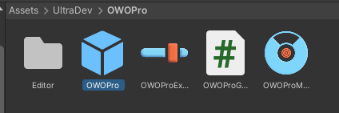
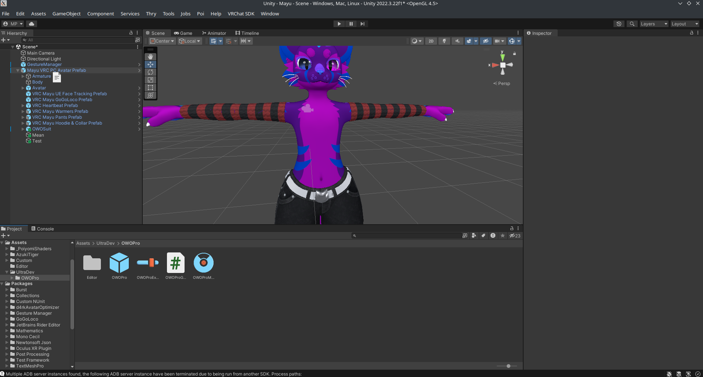
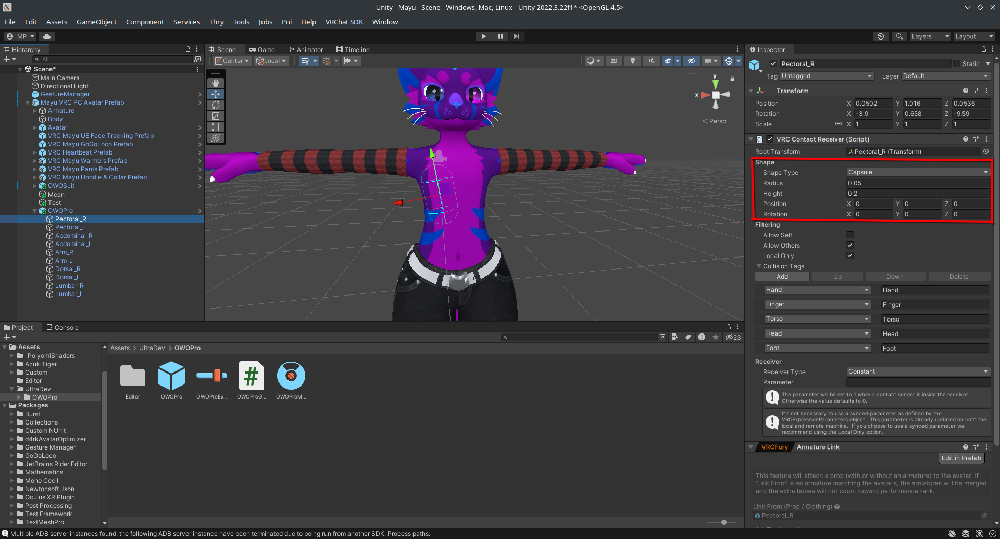
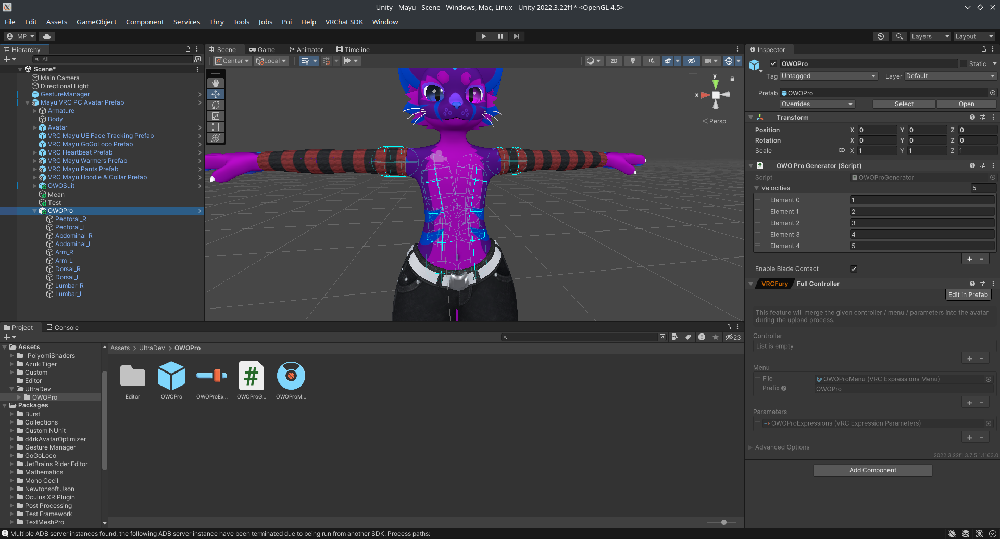
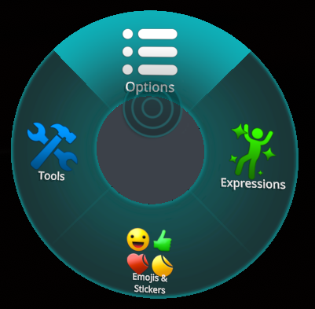
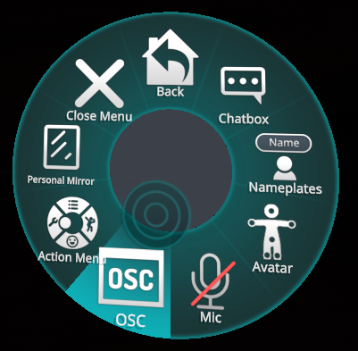
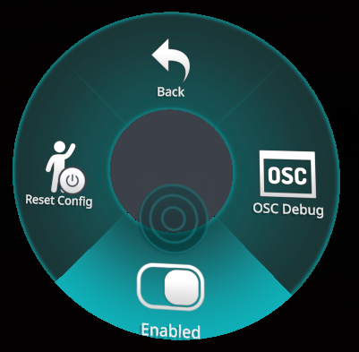

# vrc-owo
OWO vest integration for VRChat

## Features
- Depth-dependent intensity
- Impact sensation for high velocities (can be disabled in the radial menu)
- Blade contact for various sword/dagger assets

If you have ideas for further improvements, feel free to let me know in an issue

## Installation
1. Download [vrc-owo.unitypackage](https://raw.githubusercontent.com/MrMineO5/vrc-owo/refs/heads/main/vrc-owo.unitypackage)
2. Drag-and-drop into your unity project (Aklternatively, Assets > Import Package > Custom Package...)
3. Find the prefab in `Assets/UltraDev/OWOPro/OWOPro.prefab`

4. Drag the prefab onto your 

5. Adjust the contacts as desired, you can drag around the Game Object and change the shape and size

Note: Changes to collision tags and parameter name are not applied

6. (Optional) Adjust the generated contacts, you can change which and how many velocity contacts are generated, and enable/disable the blade type contact.

7. Upload your avatar!

## Usage
1. Download the latest release for your platform
2. Run the application
3. Ensure you have OSC enabled in VRChat

